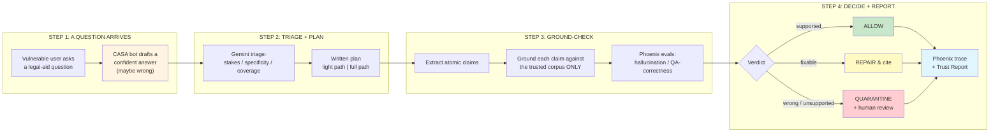
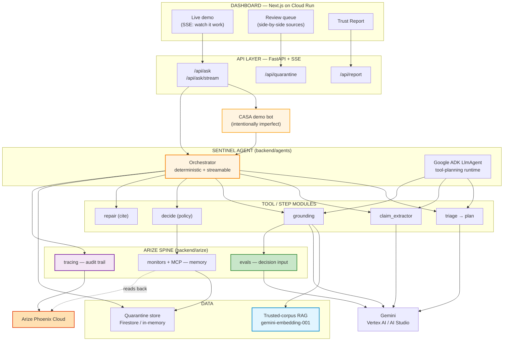
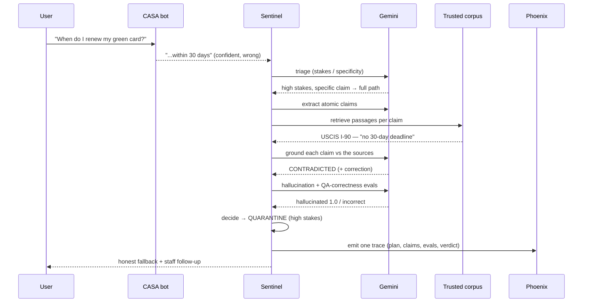

# Sentinel — A Safety Layer Against Confidently-Wrong AI

**Built with:** Python 3.12 · Google ADK · Gemini · Arize Phoenix (OpenInference + MCP) · Vertex AI embeddings · FastAPI + SSE · Next.js · Cloud Run · uv · MIT licensed

[](https://www.python.org/downloads/)
[](https://fastapi.tiangolo.com/)
[](https://google.github.io/adk-docs/)
[](https://ai.google.dev/)
[](https://arize.com/docs/phoenix)
[](https://nextjs.org/)
[](https://cloud.google.com/run)
[](https://opensource.org/licenses/MIT)

> **Model safety filters catch what's *toxic*. Sentinel catches what's *false*.**
> It doesn't write the answer. It catches the confident lie before it reaches a vulnerable person.

Sentinel is a Google ADK + Arize Phoenix guardian agent that intercepts every answer a legal-aid chatbot drafts, ground-checks each factual claim against the organization's *own trusted documents only*, and returns a graduated, human-in-the-loop verdict — **allow**, **repair & cite**, or **quarantine** — with a full Phoenix trace as the audit trail. It is the workflow-safety primitive the AI tools serving the most vulnerable communities don't have.

Enterprise AI gets million-dollar safety teams. The legal-aid clinic answering a refugee's visa question gets nothing. Model content filters catch toxicity, PII, and policy violations — they do **not** catch a polite, fluent, plausible, **factually wrong** answer: a wrong filing deadline, a wrong benefit threshold, a wrong eligibility rule. That failure mode is invisible to content moderation and catastrophic to the person who trusts it. **Sentinel exists for exactly that failure mode.**

*Google Cloud Rapid Agent Hackathon — Arize Track.*

## Quick Highlights

- **An agent, not a filter** — it *writes a plan* and takes visibly different paths: a low-stakes question ("what are your office hours?") clears on a two-line plan; a high-stakes specific claim triggers claim extraction → corpus grounding → Phoenix evals → a decision. Same code, two paths.
- **"Not found in the corpus" is treated as risk, not pass** — the one design choice that catches confident fabrications. An unsupported specific on a high-stakes topic is held, because a made-up deadline looks exactly like a true one the corpus happens not to mention.
- **Three graduated decisions, human-in-the-loop** — `ALLOW`, `REPAIR_ALLOW` (corrected + cited, never on high-stakes), `QUARANTINE` (held with an honest fallback). Thresholds are the org's policy, not the agent's.
- **Arize Phoenix is load-bearing in three structural roles** — evals as a *decision input*, OpenInference tracing as the *audit trail*, and monitors + Phoenix MCP as *self-improving memory* (the agent reads its own per-topic quarantine rates and adapts its threshold).
- **Deterministic where it matters** — every verdict is a transparent function of grounding + eval signals (`backend/agents/decide.py`, fully unit-tested, no LLM in the policy path). Gemini does the language work; rules make the safety call.
- **The corpus is the org's voice, not the internet's** — Sentinel never checks against the web. No-coverage becomes a quarantine *and* a corpus-gap entry in the weekly Trust Report.
- **34 tests, mypy strict, ruff clean** — `make lint && make test` gates types + lint + the hermetic test tiers (no network, no live LLM).

## Live Deployment

| Service | URL | Notes |
|---|---|---|
| **Director Dashboard** | https://sentinel-frontend-p3na2tgubq-uc.a.run.app | Next.js on Cloud Run — live demo, review queue, Trust Report |
| **Backend API** | https://sentinel-backend-p3na2tgubq-uc.a.run.app | FastAPI + SSE; `/health`, `/api/docs` |
| **Phoenix traces** | app.phoenix.arize.com → project `sentinel` | Every run is one OpenInference trace |
| **Source** | https://github.com/ankitlade12/sentinel-ai | Public, MIT |

Cloud Run scale-to-zero (free when idle); cold start ~10–15s, so hit the dashboard once to warm it before a latency-sensitive demo. The endpoint is open so judges can use it — see [Privacy & Posture](#privacy--posture).

## Architecture Overview

### High-Level Workflow



### System Architecture



### Tech Stack

| Layer | Technology | Purpose |
|---|---|---|
| **Agent runtime** | Google ADK (`LlmAgent`) + a deterministic orchestrator | Tool-planning runtime the Arize track requires, plus a reliable streamable sibling that shares the same step modules |
| **Reasoning** | Gemini (`gemini-2.5-flash`) via the Google GenAI SDK | Triage, claim extraction, the grounding judge, eval rationales — temperature 0, structured output |
| **Evals / traces / monitors** | Arize Phoenix via OpenInference + a Phoenix MCP server | LLM-as-a-Judge evals (decision input), one trace per run, per-topic monitors, and a Phoenix MCP server the ADK agent spawns over stdio and calls at runtime |
| **Corpus RAG** | Vertex AI / `gemini-embedding-001` + in-memory cosine | Semantic retrieval over the org's vetted documents (hermetic hashing fallback for CI) |
| **Quarantine store** | Firestore (in-memory mock for CI) | Verdict audit log + the director's review queue |
| **API** | FastAPI + SSE (sse-starlette) | Streams the agent's visible decisions to the dashboard |
| **Dashboard** | Next.js 15 + Tailwind | Live demo, side-by-side quarantine view, Trust Report |
| **Validation** | Pydantic v2 | Every boundary crossing — API / agent output / corpus / eval / store |
| **Lint / Type / Test** | ruff + mypy strict + pytest (34 tests) | `make lint && make test`; no network in the hermetic tiers |
| **Package mgmt / deploy** | uv · Docker · Cloud Run | Reproducible installs; two services auto-scaling from zero |

## The Problem

The orgs serving the most vulnerable people — legal aid, free health lines, benefits navigators — are deploying chatbots with **none** of the safety infrastructure enterprises take for granted, right as state chatbot laws (Texas TRAIGA, Utah HB 452) begin to require oversight.

- Stanford's 2026 AI Index reports hallucination rates of **22–94%** across top models.
- The dangerous failure isn't toxicity — it's a fluent, confident, **wrong** specific: "your I-90 renewal must be filed within 30 days" (there is no such deadline), "the SNAP limit for a family of three is \$2,200" (it's ~\$2,798).
- No content filter on earth flags those answers, because there's nothing toxic about them. They're just false — and they can cost someone their case, their benefits, or their status.

Most AI safety tooling is enterprise-shaped — VPCs, SIEMs, OTel pipelines. Almost nothing gives a two-person nonprofit a safety layer it can actually run.

## The Solution

Sentinel is the layer that sits between a chatbot's answer and a vulnerable person:

- **Triages** every answer and *writes a plan* — deciding how hard to check based on what's at stake, then taking a visibly different path for a logistics question vs a high-stakes specific claim.
- **Grounds** each atomic claim against the org's trusted corpus only — never the web — returning supported / contradicted / not-found, with the contradicting source attached.
- **Decides** with a transparent, org-set policy — allow, repair-and-cite, or quarantine — and never silently rewrites or blocks without telling the user something true.
- **Reports** — every run is one Phoenix trace, and the weekly Trust Report renders the accumulated data in language a non-technical director can read over coffee.

The chatbot still answers. Sentinel only makes sure a confident lie never reaches the person who'd trust it.

## The Core Logic (transparent rules, no black-box in the safety path)

### Triage — how hard to check

| Dimension | Values | How |
|---|---|---|
| **Stakes** | low / medium / high | Gemini rubric: does it touch a deadline, money, legal rights, health, immigration status, or eligibility? (The *user's* stakes are high; the clinic's own logistics are low/medium.) |
| **Specificity** | general info / specific claim | Does it assert a checkable date, amount, form number, or rule? |
| **Coverage** | in-corpus / out-of-corpus | Embedding similarity to the trusted corpus |

**Path** = `full` if stakes are high, *or* medium-stakes with a checkable specific; otherwise `light`. The full path extracts claims, grounds each, runs evals, and checks risk history; the light path is a safety glance, then allow. **This branching is the difference between scoring as an agent and scoring as a filter.**

### Grounding — why "not found" is risk

Each checkable claim is judged **only** against retrieved trusted passages:

- **supported** — a source clearly establishes the claim.
- **contradicted** — a source states something incompatible (and supplies the correction).
- **not_found** — no source confirms the specific → **treated as risk, not pass.** A confident fabrication looks exactly like a true statement the corpus happens not to mention; passing unsupported specifics would pass the fabrications.

### Decision matrix (`backend/agents/decide.py`)

| Signals | Stakes | Decision |
|---|---|---|
| Every claim supported, evals clean | any | `ALLOW` — deliver the original |
| A claim contradicted, correction derivable from corpus | medium | `REPAIR_ALLOW` — deliver a corrected, **labeled + cited** answer |
| Contradicted / not-found / eval over threshold | **high** | `QUARANTINE` — held; honest fallback to the user; human review required |
| Any not-found on a high-stakes topic, or safety check fails | high | `QUARANTINE` |

Two rules are absolute: **never silently rewrite without labeling**, and **never block without telling the user something true.** REPAIR never fires on high-stakes — those always reach a person.

### Self-improvement — monitoring as memory

A topic's risk threshold adapts to its own history (`backend/arize/monitors.py`): quarantine-rate `0.20 → +0.00`; `0.50+ → +0.15` (capped), with a sample floor. A topic that's been drifting raises its own support bar, so borderline answers on it are held more readily — and every effective threshold is recorded on the verdict's `policy_snapshot`. The **Google ADK agent reads the same signal at runtime by calling the Phoenix MCP server** (`backend/arize/phoenix_mcp_server.py`) — a Python MCP server it spawns over stdio that queries Arize Phoenix Cloud live.

## Arize Phoenix — three load-bearing roles

| Role | Module | What it does |
|---|---|---|
| **Evals as a decision input** | `backend/arize/evals.py` | Phoenix-style LLM-as-a-Judge (hallucination / QA-correctness / toxicity) with the corpus passages as ground-truth context — *consumed by the decider*, not logged after the fact |
| **Tracing as the audit trail** | `backend/arize/tracing.py` | Every run is one OpenInference trace (triage → claims → grounding → evals → decision); when an AI-accountability rule asks the clinic to *prove oversight*, the trace **is** the answer |
| **Monitoring as memory** | `backend/arize/monitors.py` + `mcp.py` + `phoenix_mcp_server.py` | The agent reads back its own per-topic quarantine rates and adapts — the self-improvement loop. The **Google ADK agent spawns the Phoenix MCP server over stdio and calls it at runtime** (`phoenix_project_summary` queries Phoenix Cloud live) |

See [`docs/ARIZE.md`](docs/ARIZE.md).

## Features

**The agent loop (`backend/agents`)** — `triage` (writes the plan) · `claim_extractor` · `grounding` (the catch) · `decide` (the policy) · `repair` (corrected + cited) · `sentinel` (the streamable orchestrator) · `adk_agent` (the Google ADK runtime + function tools).

**The three components**

- **CASA bot** — a deliberately imperfect demo legal-aid chatbot (a prop, intentionally prone to confident specifics) that gives Sentinel something real to catch.
- **Sentinel agent** — the product; intercepts every CASA answer and runs the loop.
- **Director Dashboard** — the non-technical interface: a live demo that streams the agent working, a quarantine queue showing the bot's claim **side-by-side** with the contradicting source, and the weekly Trust Report.

**The Trust Report** — a weekly, one-page, plain-English document generated from accumulated verdicts + monitor data: how many answers were cleared / corrected / held, what was caught (with sources), the trend (including a stale-corpus nudge), riskiest/safest topics, and corpus gaps. No metric without a sentence of meaning.

## Demo Flow

Open the dashboard and click a sample question. The three verdict types, each reproducible:

```text
1. "When do I have to renew my green card?"
     CASA: "...within 30 days..." (confident, wrong)
     → QUARANTINE — claims contradicted by the USCIS I-90 doc, shown side-by-side

2. "What are your office hours?"
     → ALLOW — low stakes, no checkable claim, light path, ~3s

3. "Does the clinic charge a fee for a consultation?"
     CASA: "...a $75 fee..." (the clinic is free)
     → REPAIR & ALLOW — corrected, labeled, and cited from the clinic FAQ
```

The money shot is #1: the dashboard streams the plan, the claim extraction, the grounding verdicts arriving with their sources, the eval scores — then holds the answer and shows the official USCIS text that contradicts the bot, with a one-click link to the Phoenix trace.

### Tool-Call Sequence



## Project Structure

```text
sentinel/
├── backend/
│   ├── models/        # Pydantic contract (triage, claim, grounding, eval, verdict, trust report)
│   ├── connectors/    # CorpusConnector + QuarantineStore protocols (mock + Vertex/Firestore)
│   ├── corpus/        # the org's vetted trusted documents + loader/chunker
│   ├── vectorstore/   # embedders (Gemini/Vertex + deterministic hashing) + cosine
│   ├── agents/        # triage · claim_extractor · grounding · decide · repair · sentinel
│   │   ├── adk_agent.py   # Google ADK LlmAgent runtime
│   │   ├── tools/         # ADK function tools wrapping the step modules
│   │   └── prompts/       # system prompts as markdown
│   ├── arize/         # evals (decision input) · tracing (audit) · monitors + Phoenix MCP server (memory)
│   ├── casa/          # the demo legal-aid bot (a prop)
│   ├── reports/       # the Trust Report generator
│   ├── api/           # FastAPI app + SSE endpoints
│   └── tests/         # unit · contract · integration (34 tests, hermetic)
├── frontend/          # Next.js dashboard — live demo, review queue, Trust Report
├── scripts/           # index_corpus · eval_scenarios · generate_typescript_types
├── docs/              # PRD · ARCHITECTURE · DECISIONS · ARIZE · LOCAL_DEV · GCP_SETUP
├── pyproject.toml     # Python deps + tool config
├── Makefile           # setup / index / demo / test / lint / dev / docker
└── docker-compose.yml
```

## Quick Start

Prerequisites: Python 3.12 (via `uv`), Node 20+, and a Gemini key (AI Studio is free) and/or a Google Cloud project; a free Arize Phoenix key for tracing.

### Hermetic — no cloud, runs the full test suite offline

```bash
uv sync --extra dev
SENTINEL_CORPUS=mock SENTINEL_STORE=mock make test     # 34 tests, no network
make lint                                              # ruff + mypy strict
```

### Live — real Gemini reasoning + real Phoenix traces (no GCP project needed)

```bash
cp .env.example .env          # set SENTINEL_LLM_PROVIDER=ai_studio + GEMINI_API_KEY + PHOENIX_*
uv sync --extra dev
make dev-backend              # FastAPI + SSE on :8000   (terminal A)
make dev-frontend             # Next.js dashboard on :3000 (terminal B)
make demo                     # run the canonical scenarios through CASA → Sentinel
```

Or one command with containers: `cp .env.example .env && docker compose up -d --build`. See [`docs/LOCAL_DEV.md`](docs/LOCAL_DEV.md) and [`docs/GCP_SETUP.md`](docs/GCP_SETUP.md).

## Privacy & Posture

**Sentinel does:** ground only against the org's vetted corpus (never the web) · keep a human in the loop for every high-stakes answer · attach the contradicting source to every catch · make every verdict a transparent function of grounding + eval signals.

**Sentinel never:** silently rewrite an answer · block one without telling the user something true · auto-repair a high-stakes answer · let a model decide the org's quarantine policy.

The Trust Report states it plainly on every page: *Sentinel reduces risk; it does not eliminate it. Quarantine thresholds are your clinic's policy, and human review remains mandatory for high-stakes answers.* The public demo endpoint is intentionally open so judges can use it; for a real deployment, gate `/api/ask` behind an API key or IAP and switch the store to Firestore.

## Why Sentinel Stands Out

- **Safety, not generation.** Most agents produce something — answers, summaries, triage. Sentinel watches another AI and catches the confident-but-wrong answer at the moment of delivery. It's the horizontal primitive a community keeps, not a one-shot output.
- **Deterministic where it matters, AI only where it's safe.** Gemini does the language work (English → structured claims, the grounding judgment); a transparent rule table makes the actual allow/repair/quarantine call. The model never decides the org's policy.
- **Arize is structural, not decorative.** Evals feed the decision, every run is a trace, and the agent improves from its own monitor data — three roles a thin integration can't fake.
- **The corpus is the product's conscience.** Grounding against the org's voice (not the internet) is what makes "I don't know" safe and turns "we don't cover this" into a corpus-gap feature instead of a hallucination.
- **Honest about the platform.** It runs hermetically on mocks for CI and scales to Vertex + Firestore + autoscaling Cloud Run by flipping env vars — the same agent code, clearly labeled, never faked.

## License

MIT — see [LICENSE](./LICENSE). Built for the people enterprise AI safety forgot.

---

*"Enterprises buy AI safety. Communities deserve it."* — Sentinel is the watchdog for everyone else.
